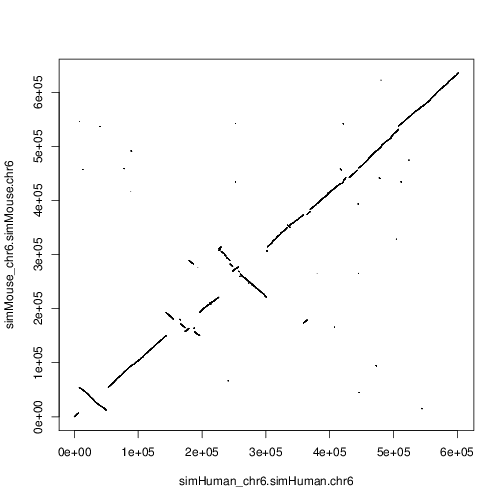

# Dotplot script
Get a dotplot relating two sequences in a HAL file. Requires the statistical language R.
## Usage
```
$ source PROGRESSIVE_CACTUS_DIR/environment
$ ./runDotplot.py <halFile> <genome name for X axis> <sequence name for x axis> <genome name for y axis> <sequence name for y axis> > dotplot.tsv
$ ./plotDotplot.R dotplot.tsv output.pdf
```

## Example
### Command line
```
$ source ~/progressiveCactus/environment
$ ./runDotplot.py ~/progressiveCactus-phylogeny/mammals1/original.hal simHuman_chr6 simHuman.chr6 simMouse_chr6 simMouse.chr6 > t.tsv
$ ./plotDotplot.R t.tsv out.pdf
```
### Result

